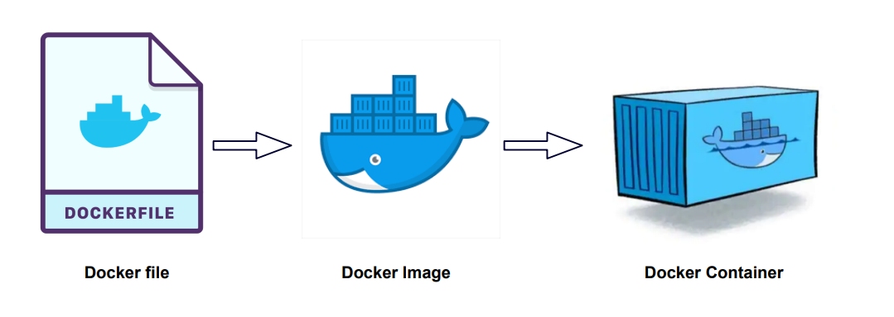

# Docker



Run container based on python image with version 3.9 in interactive mode (meaning that we will see Pythom prompt after running the container):
```bash
docker container run -it python:3.9
```

If we want to install Python libraries to this container (like `pip install pandas`), we need to enter to get to BASH in this container to be able to run commands.

This can be done by specifying **bash** in the `--entrypoint` flag.

> The ENTRYPOINT instruction sets the default executable for the container. Any arguments supplied to the docker run command are appended to the ENTRYPOINT command.

ENTRYPOINT can be useful in images built for a specific purpose where overriding the default executable is not desired (for example, like our Python image, where default exacutable is `python3`).

```bash
docker container run -it --entrypoint=bash python:3.9
```

When we run the container with bash as an entrypoint, we see bash prompt and now we can install pandas with pip:

```bash
pip install pandas
```

After installing pandas while we are still in bash, we can run python and check if pandas is available:

```bash
python
```
```python
import pandas
pandas.__version__
> '2.2.3'
```

**BUT**!

If we stop the container and execute `docker container run ...` again, **pandas** package won't be available anymore, because **we create a new container instance** from an image every time we run `docker container run ...` command.

So, we need to instruct Docker to install pandas every time we build a container from an image.

To do so, we can put these instructions into a **Docker** file.

Create a file named Dockerfile in your project's root folder and paste the following content:

```dockerfile
FROM python:3.9

RUN pip install pandas

ENTRYPOINT [ "bash" ]
```

This will instruct Docker to do the following things during creating a container from an image:
- find python image with version 3.9 locally or fetch it from docker hub
- execute `pip install command' when building a container:
    > The RUN instruction will execute any commands to create a new layer on top of the current image. The added layer is used in the next step in the Dockerfile.

    **NOTE:** this RUN is an istruction for Docker, it is not related to commands in ENTRYPOINT. Under the hood it executes the following command (because our python:3.9 image is based on Debian, it executes /bin/sh):
    ```
    RUN /bin/sh -c pip install pandas # buildkit
    ```
- execute bash binary after a container is launched. Note that this is not necessary - if we don't add this instruction, the container will use default path used in the python image we specified in the `FROM python:3.9` instruction (in this case, it is `python3`, so by default a container will start with python prompt).


Then let's try to run a python script from a file in our container.

Create a file named `pipeline.py` in the root directory of the project and paste the following code:

```python
import pandas as pd

print("Job finished succesfully")
```

Running this file we just want to make sure that pandas is available in our container and can be used in our pipeline tasks.

Then we need to somehow make this file available for our container.
It will not be available by default, because a container is isolated - it has its own filesystem and doesn't have access to filesystem of our host computer.

To make the `pipeline.py` script available for our container, we need to insruct Docker to **COPY** this file during building an image. We can do this by adding the follofing instructions into a Dockerfile:

```dockerfile
WORKDIR /app
COPY pipeline.py pipeline.py
```

- `WORKDIR /app` sets the working directory for any subsequent ADD, COPY, CMD, ENTRYPOINT, or RUN instructions that follow it in the Dockerfile.
- `COPY pipeline.py pipeline.py` instruction copies a file. First parameter is the source filename,  second is the destination filename:
    > COPY hello.txt /absolute/path

    > COPY hello.txt relative/to/workdir

So, the `pipeline.py` file will be copied to `/app/pipeline.py` in a container filesystem.

So when we build an image and run a container, we will be `cd`-ed into `/app`, where our `pipeline.py` script is available!

```bash
docker image build --tag test_python:pandas .
docker container run -it test_python:pandas
# root@8c8d21837c02:/app#
```


Let's modify oour pipeline script to accept arguments:

```python
import sys
import pandas as pd

print(sys.argv)

day = sys.argv[1]

print(f"Job finished succesfully for {day}")
```

Also, lets modify the ENTRYPOINT instruction in the Dockerfile to execute python by default and run the pipeline.py script:

```dockerfile
ENTRYPOINT [ "python", "pipeline.py" ]
```

Our Dockerfile now looks like this:

```dockerfile
FROM python:3.9

RUN pip install pandas

WORKDIR /app
COPY pipeline.py pipeline.py

ENTRYPOINT [ "python", "pipeline.py" ]
```

So, when we run `docker container run` it will go with `python pipeline.py` command.

Let's build the image again. Note that if we specify the same tag we used previosly, our build will overwrite the existing image:

```bash
docker image build --tag test_python:pandas .
```

After that, let's run a container from the image, but this time let's add an additional part parameter to the command - 2025-01-01 after the tag (let's pretend that our script ingests a data for a specific date we specify in the docker container run command):

```bash
docker container run -it test_python:pandas 2025-01-01
```

Docker interprets everything that comes after IMAGE and [COMMAND] in the `docker container run [OPTIONS] IMAGE [COMMAND] [ARG..]` as arguments, so they are available in python. The output of the previous run command will be:

```
['pipeline.py', '2025-01-01']
Job finished succesfully for 2025-01-01
```

If we add more arguments to the run command, they will be available in container, but since our script uses only first positional argument, only date will be printer in the "Job finished succesfully..." message:

```bash
docker container run -it test_python:pandas 2025-01-01 123 hello
```
Output:
```
['pipeline.py', '2025-01-01', '123', 'hello']
Job finished succesfully for 2025-01-01
```

# Ingesting NY taxi data to Postgres


Now we are going to run a container with a Postgres database image.
We want to ingest data from a CSV file into a Postgres DB.

Next, we need to spin up a container with the `docker container run ...` command.

It will be based on an official postgres image version 13 from Docker Hub (postgres:13).

We also specify required Postgres credentials to access our database (user, password and database name) in the environmental variables (`--env` flag).

Since Postgres is a database, it needs a storage (filesystem) to save its databases somewhere. And Docker doesn't  keep a state every time we run a new container.\
So we need to assign a persistent storage for our container. 

**It can be done with *volumes* in Docker.**\
By specifying the `--volume source_path:destination_path` option, we can bind a directory on our host machine to act like a persistent disk in a container.

Postgres saves its data in the `/var/lib/postgresql/data` directory.

On Mac, we can use `$(pwd)` variable to use our current working directory:
```bash
--volume $(pwd)/ny_taxi_postgres_data:/var/lib/postgresql/data
```

Also, we need to map a port on our host machine to a port in our container to be able to send request to our database (send SQL requests and recieve responses).\
The default PostgreSQL port is **5432**.
We publish ports by using the `--publish host_port:container_port` option:
```bash
--publish 5432:5432
```

**Note:** back slash `\` is used to excape a following symbol. In our case it is a new line symbol, and `\` tells bash to ignore new lines, so it interpretes the command as a one-liner. We are doing this just for readability, so that our command looks pretty and easy to read.

```bash
docker container run -it \
    --env POSTGRES_USER="root" \
    --env POSTGRES_PASSWORD="root" \
    --env POSTGRES_DB="ny_taxi" \
    --volume $(pwd)/ny_taxi_postgres_data:/var/lib/postgresql/data \
    --publish 5432:5432 \
postgres:13
```

After running this command we can see something like this:
```bash
# 2025-01-26 09:31:32.424 UTC [1] LOG:  database system is ready to accept connections
```

That means, that Postgres has been installed succesfully into our container.

We can now navigate to the `ny_taxi_postgres_data` folder and see, how Postgres filesystem looks like:

```
base
global
pg_commit_ts
pg_dynshmem
...
postmaster.opts
postmaster.pid
```

Next let's try to establish a connection to our database using the `pgcli` Python library.

I'm using [uv](https://github.com/astral-sh/uv) for managing Python environments and packages, so let's install `pgcli` into a virtual environment:

```bash
uv add psycopg-binary
uv add pgcli
```

After install pgcli let's connect to Postgres:

```bash
pgcli -h localhost -p 5432 -u root -d ny_taxi
```

## Load data into Postgres

Download the following files and put them into the `source_data` folder in the project:
- `yellow_tripdata_2021-01.csv` file from [here](https://github.com/DataTalksClub/nyc-tlc-data/releases/download/yellow/yellow_tripdata_2021-01.csv.gz) or parquet file from [original source](https://www.nyc.gov/site/tlc/about/tlc-trip-record-data.page). Make sure to download **"Yellow Taxi Trip Records"** for January 2021.

- [Data Dictionary file](https://www.nyc.gov/assets/tlc/downloads/pdf/data_dictionary_trip_records_yellow.pdf), which describes each column in our source file.

- [Taxi Zone Lookup Table](https://d37ci6vzurychx.cloudfront.net/misc/taxi_zone_lookup.csv).

To make sure that the number of rows in our source file is `1369766`, run the word count command with the -l option to count lines:

```bash
wc -l /source_data/yellow_tripdata_2021-01.csv 
```
Output:
```bash
# 1369766 yellow_tripdata_2021-01.csv
```

**Let's create a Python notebook.**

Add the following packages to the virtual environment:
- ipykernel
- pandas
- sqlalchemy
- psycopg2-binary

```bash
uv add ipykernel pandas sqlalchemy psycopg2-binary
```

Create `upload_data.ipynb` file in the project directory.

**Please see comments in the [upload_data.ipynb](upload_data.ipynb) file.**

An alternative way to connect to the Postgres database using `sqlalchemy` is described in the [pg_test_connection.ipynb](pg_test_connection.ipynb) file.


## Connecting pgAdmin and Postgres

pgAdmin is GUI tool for PostgreSQL.

Pull the official image of pgAmin from Docker HUB:

```bash
docker pull dpage/pgadmin4
```

Run a docker container from the downloaded image `dpage/pgadmin4` with the following options:

```bash
docker container run -it \
    --env PGADMIN_DEFAULT_EMAIL="admin@admin.com" \
    --env PGADMIN_DEFAULT_PASSWORD="root" \
    --publish 8080:80 \
dpage/pgadmin4
```

Now we can open pgAdmin web UI: http://localhost:8080/browser/.

When we try to add a new database to the pgAdmin, we need to specify a host name.
We can not specify `localhost`, because our pgAdmin instance is running in one Docker container, and our Postgres is running in another container, so they unable to see each other and communicate via network.

What we need to do is to create a network.

First stop both running containers.

Create a new network:

```bash
docker network create pg-network
```

Then we need to run new containers and specify:
- which network they should use in the `--network=pg-network` option
- names for each container in the `--name` option, so that they know how to refer to each other

**Postgres:**
```bash
docker container run -it \
    --env POSTGRES_USER="root" \
    --env POSTGRES_PASSWORD="root" \
    --env POSTGRES_DB="ny_taxi" \
    --volume $(pwd)/ny_taxi_postgres_data:/var/lib/postgresql/data \
    --publish 5432:5432 \
    --network=pg-network \
    --name=postgres-database \
postgres:13
```

**pgAdmin:**
```bash
docker container run -it \
    --env PGADMIN_DEFAULT_EMAIL="admin@admin.com" \
    --env PGADMIN_DEFAULT_PASSWORD="root" \
    --publish 8080:80 \
    --network=pg-network \
    --name=pgadmin4 \
dpage/pgadmin4
```

Now we can navigate to the [pgAdmin UI](http://localhost:8080/browser/) and add a new server:
- Host name/address: `postgres-database`
- Port: `5432`
- Maintenance database: `postgres`
- Username: `root`
- Password: `root`


## Dockerizing the Ingestion Script

Export[ upload_data.ipynb ](upload_data.ipynb) as script,
name the new file ingest_data.py and place it in the same directory.

Run this file locally to make sure that it ingests data correctly.

```bash
python ingest_data.py \
    --user=root \
    --password=root \
    --host=localhost \
    --port=5432 \
    --database=ny_taxi \
    --table=yellow_taxi_data
```

Now we are ready to dockerize our ingestion script.

Note: we are also going to replace CSV with parquet file, that we will be downloading from the NYC website. So we change the ingestion script:
- change `load_csv` to `load_parquet`
- remove iterator

We need to make changes to our Dockerfile:

In addition to `pandas` we need to install `sqlalchemy`, `psycopg2` (package for accessing Postgres with Python) and `pyarrow` (needed for working with parquet).

```dockerfile
RUN pip install pandas sqlalchemy psycopg2 pyarrow
```

We also need to install `wget` so that our container can download csv files.

```dockerfile
RUN apt-get install wget
```

and rename script files:

```dockerfile
COPY ingest_data.py ingest_data.py

ENTRYPOINT [ "python", "ingest_data.py" ]
```

Then build an image:

```bash
docker image build --tag ingest_data_dockerized .
```

After the image is built, we can run a container with all the parameters we specified earlier when running the Python script. We also need to specify the network (`pg-network`), otherwise the container with the database won't be visible for our container with the script.

`--network=pg-network` should be added **before** the name of the image, because it is a docker parameter.

! We need to specify the name of the container with the Postgres database in the host parameter instead of `localhost`, because it is in the `pg-network` now.

```bash
docker container run -it --network=pg-network ingest_data_dockerized \
        --user=root \
        --password=root \
        --host=postgres-database \
        --port=5432 \
        --database=ny_taxi \
        --table=yellow_taxi_data \
        --url="https://d37ci6vzurychx.cloudfront.net/trip-data/yellow_tripdata_2021-01.parquet"
```

Result:

```
Inserted another chunk, took 67.907 seconds
```

# Docker Compose

We can combine instructions for multiple containers and run them with a single command isung `docker compose`.

In ordrer to do thi, we need to create a `docker-compose.yaml` file.

```yaml
services:
  pgdatabase:
    container_name: pgdatabase
    image: postgres:13
    environment:
      - POSTGRES_USER=root
      - POSTGRES_PASSWORD=root
      - POSTGRES_DB=ny_taxi
    volumes:
      - "./ny_taxi_postgres_data:/var/lib/posgresql/data:rw"
  pgadmin:
    container_name: pgadmin
    image: dpage/pgadmin4
    environment:
      - PGADMIN_DEFAULT_EMAIL=admin@admin.com
      - PGADMIN_DEFAULT_PASSWORD=root
    ports:
      - "8080:80"
```

Note: we don't need to specify network, because all containers (services) created via sigle docker-compose will have the same network.

After the containers are up, we can navigate to pgAdmin UI and add a new database connection. As a hostname we should specify `pgdatabase`, because this is the name of the service with our PG database.

```bash
docker compose up -d # Detached mode: Run containers in the background
docker compose down # Stop and remove containers, networks
docker compose stop # Stops containers without deleting them
docker compose start # Start stopped containers again
```
