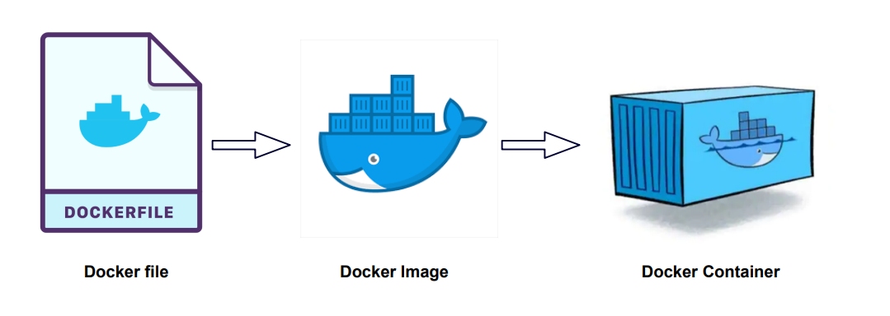

# Notes

## Docker



Run container based on python image with version 3.9 in interactive mode (meaning that we will see Pythom prompt after running the container):
```bash
docker container run -it python:3.9
```

If we want to install Python libraries to this container (like `pip install pandas`), we need to enter to get to BASH in this container to be able to run commands.

This can be done by specifying **bash** in the `--entrypoint` flag.

> The ENTRYPOINT instruction sets the default executable for the container. Any arguments supplied to the docker run command are appended to the ENTRYPOINT command.

ENTRYPOINT can be useful in images built for a specific purpose where overriding the default executable is not desired (for example, like our Python image, where default exacutable is `python3`).

```bash
docker container run -it --entrypoint=bash python:3.9
```

When we run the container with bash as an entrypoint, we see bash prompt and now we can install pandas with pip:

```bash
pip install pandas
```

After installing pandas while we are still in bash, we can run python and check if pandas is available:

```bash
python
```
```python
import pandas
pandas.__version__
> '2.2.3'
```

## BUT!

If we stop the container and execute `docker container run ...` again, **pandas** package won't be available anymore, because **we create a new container instance** from an image every time we run `docker container run ...` command.

So, we need to instruct Docker to install pandas every time we build a container from an image.

To do so, we can put these instructions into a **Docker** file.

Create a file named Dockerfile in your project's root folder and paste the following content:

```dockerfile
FROM python:3.9

RUN pip install pandas

ENTRYPOINT [ "bash" ]
```

This will instruct Docker to do the following things during creating a container from an image:
- find python image with version 3.9 locally or fetch it from docker hub
- execute `pip install command' when building a container:
    > The RUN instruction will execute any commands to create a new layer on top of the current image. The added layer is used in the next step in the Dockerfile.

    **NOTE:** this RUN is an istruction for Docker, it is not related to commands in ENTRYPOINT. Under the hood it executes the following command (because our python:3.9 image is based on Debian, it executes /bin/sh):
    ```
    RUN /bin/sh -c pip install pandas # buildkit
    ```
- execute bash binary after a container is launched. Note that this is not necessary - if we don't add this instruction, the container will use default path used in the python image we specified in the `FROM python:3.9` instruction (in this case, it is `python3`, so by default a container will start with python prompt).


Then let's try to run a python script from a file in our container.

Create a file named `pipeline.py` in the root directory of the project and paste the following code:

```python
import pandas as pd

print("Job finished succesfully")
```

Running this file we just want to make sure that pandas is available in our container and can be used in our pipeline tasks.

Then we need to somehow make this file available for our container.
It will not be available by default, because a container is isolated - it has its own filesystem and doesn't have access to filesystem of our host computer.

To make the `pipeline.py` script available for our container, we need to insruct Docker to **COPY** this file during building an image. We can do this by adding the follofing instructions into a Dockerfile:

```dockerfile
WORKDIR /app
COPY pipeline.py pipeline.py
```

- `WORKDIR /app` sets the working directory for any subsequent ADD, COPY, CMD, ENTRYPOINT, or RUN instructions that follow it in the Dockerfile.
- `COPY pipeline.py pipeline.py` instruction copies a file. First parameter is the source filename,  second is the destination filename:
    > COPY hello.txt /absolute/path

    > COPY hello.txt relative/to/workdir

So, the `pipeline.py` file will be copied to `/app/pipeline.py` in a container filesystem.

So when we build an image and run a container, we will be `cd`-ed into `/app`, where our `pipeline.py` script is available!

```bash
docker image build --tag test_python:pandas .
docker container run -it test_python:pandas
# root@8c8d21837c02:/app#
```


Let's modify oour pipeline script to accept arguments:

```python
import sys
import pandas as pd

print(sys.argv)

day = sys.argv[1]

print(f"Job finished succesfully for {day}")
```

Also, lets modify the ENTRYPOINT instruction in the Dockerfile to execute python by default and run the pipeline.py script:

```dockerfile
ENTRYPOINT [ "python", "pipeline.py" ]
```

So, when we run `docker container run` it will go with `python pipeline.py` command.

Let's build the image again. Note that if we specify the same tag we used previosly, our build will overwrite the existing image:

```bash
docker image build --tag test_python:pandas .
```

After that, let's run a container from the image, but this time let's add an additional part parameter to the command - 2025-01-01 after the tag (let's pretend that our script ingests a data for a specific date we specify in the docker container run command):

```bash
docker container run -it test_python:pandas 2025-01-01
```

Docker interprets everything that comes after IMAGE and [COMMAND] in the `docker container run [OPTIONS] IMAGE [COMMAND] [ARG..]` as arguments, so they are available in python. The output of the previous run command will be:

```
['pipeline.py', '2025-01-01']
Job finished succesfully for 2025-01-01
```

If we add more arguments to the run command, they will be available in container, but since our script uses only first positional argument, only date will be printer in the "Job finished succesfully..." message:

```bash
docker container run -it test_python:pandas 2025-01-01 123 hello
```
Output:
```
['pipeline.py', '2025-01-01', '123', 'hello']
Job finished succesfully for 2025-01-01
```